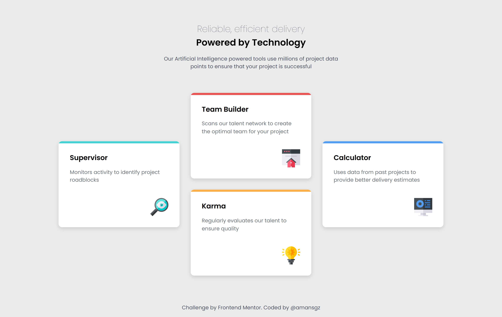

# Frontend Mentor - Four Card Feature Section

This is a solution to the [Four card feature section challenge on Frontend Mentor](https://www.frontendmentor.io/challenges/four-card-feature-section-weK1eFYK).

## Table of contents

- [Overview](#overview)
  - [The challenge](#the-challenge)
  - [Screenshot](#screenshot)
  - [Links](#links)
- [My process](#my-process)
  - [Built with](#built-with)
  - [What I learned](#what-i-learned)
  - [Continued development](#continued-development)
  - [Useful resources](#useful-resources)
- [Author](#author)
- [Acknowledgments](#acknowledgments)

## Overview

### The challenge

Users should be able to:

- View the optimal layout for the site depending on their device's screen size

### Screenshot



### Links

- Solution URL: [https://www.frontendmentor.io/solutions/responsive-grid-features-section-4YCA00I9Tv](https://www.frontendmentor.io/solutions/responsive-grid-features-section-4YCA00I9Tv)

- Live Site URL: [https://amansgz.github.io/building-responsive-layouts/four-card-feature-section/index.html](https://amansgz.github.io/building-responsive-layouts/four-card-feature-section/index.html)

## My process

### Built with

- Semantic HTML5 markup
- BEM Methodology
- CSS custom properties
- Flexbox
- CSS Grid
- Mobile-first workflow

### What I Learned

- **CSS Pseudo-elements**: Used `::before` to create stylish top borders for each card.

```css
.feature__card::before {
  content: "";
  position: absolute;
  inset-block-start: 0;
  inset-inline-start: 0;
  inline-size: 100%;
  block-size: 0.4rem;
}
.feature__card--supervisor::before {
  background-color: var(--cyan);
}
.feature__card--builder::before {
  background-color: var(--red);
}
.feature__card--karma::before {
  background-color: var(--orange);
}
.feature__card--calculator::before {
  background-color: var(--blue);
}
```

- **CSS Grid**: implemented responsive grid layouts for tablets and desktops via `grid-template-columns`. Positioned cards using `grid-column` and `grid-row` properties on desktop.

### Continued development

Moving forward, I aim to build more efficient and accessible responsive websites, focusing on performance and user experience across different devices.

### Useful resources

- [Building responsive layouts](https://www.frontendmentor.io/learning-paths/building-responsive-layouts-z1qCXVqkD) - This challenge is part of Frontend Mentor's learning path. The challenges in this path are designed to help you get to grips with making layouts that work across all devices.

## Author

- Frontend Mentor - [@amansgz](https://www.frontendmentor.io/profile/amansgz)
- Github - [@amansgz](https://github.com/amansgz)

## Acknowledgments

- [Frontend Mentor](https://www.frontendmentor.io/) challenges help you improve your coding skills by building realistic projects.
