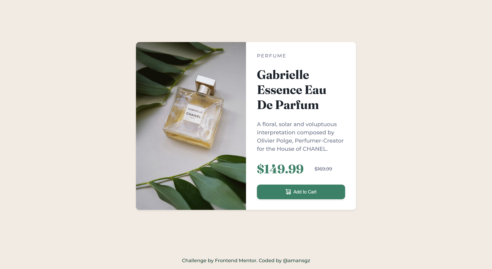

# Frontend Mentor - Product Preview Card

This is a solution to the [Product preview card component challenge on Frontend Mentor](https://www.frontendmentor.io/challenges/product-preview-card-component-GO7UmttRfa).

## Table of contents

- [Overview](#overview)
  - [The challenge](#the-challenge)
  - [Screenshot](#screenshot)
  - [Links](#links)
- [My process](#my-process)
  - [Built with](#built-with)
  - [What I learned](#what-i-learned)
  - [Continued development](#continued-development)
  - [Useful resources](#useful-resources)
- [Author](#author)
- [Acknowledgments](#acknowledgments)

## Overview

### The challenge

Users should be able to:

- View the optimal layout depending on their device's screen size
- See hover and focus states for interactive elements

### Screenshot



### Links

- Solution URL: []()
- Live Site URL: [https://amansgz.github.io/building-responsive-layout/product-preview-card/index.html](https://amansgz.github.io/building-responsive-layout/product-preview-card/index.html)

## My process

### Built with

- Semantic HTML5 markup
- BEM methodology
- CSS custom properties
- Flexbox
- Mobile-first workflow

### What I learned

This project was a great opportunity to implement several key modern responsive web development techniques:

- **Mobile-First CSS Architecture**

I structured my styles starting with the base for mobile devices (small screens), then used `min-width` media queries to progressively enhance the layout for larger screens (tablets, desktops). This approach ensures a solid experience for the most constrained devices and efficiently adds complexity as more screen space becomes available.

- **Responsive Images with the `<picture>` element**

To serve the most optimized image for each viewport, I used the `<picture>`with `<source>` tags using `media` attributes. This allows the browser to select different image files based on the user's screen size, improving both performance and visual impact.

```html
<picture>
  <source
    media="(min-width: 48rem)"
    srcset="./assets/images/image-product-desktop.jpg"
  />

  
</picture>
```

- **Fluid Typography with** `clamp()`

CSS `clamp()` function creates fluid type that scales smoothly between a minimum size, a preferred size, and a maximum size. It results in a more dynamic and maintainable typographic system.

```css
.card__title {
  font-size: clamp(2.28rem, 4vw + 0.5rem, 2.57rem);
}
```

### Continued development

Moving forward, I aim to build more efficient and accessible responsive websites, focusing on performance and user experience across different devices.

### Useful resources

- [Building responsive layouts](https://www.frontendmentor.io/learning-paths/building-responsive-layouts-z1qCXVqkD) - This challenge is part of Frontend Mentor's learning path. The challenges in this path are designed to help you get to grips with making layouts that work across all devices.

## Author

- Frontend Mentor - [@amansgz](https://www.frontendmentor.io/profile/amansgz)
- Github - [@amansgz](https://github.com/amansgz)

## Acknowledgments

- [Frontend Mentor](https://www.frontendmentor.io/) challenges help you improve your coding skills by building realistic projects.
- [DeepSeek AI](https://www.deepseek.com/) assistance with English writing.
