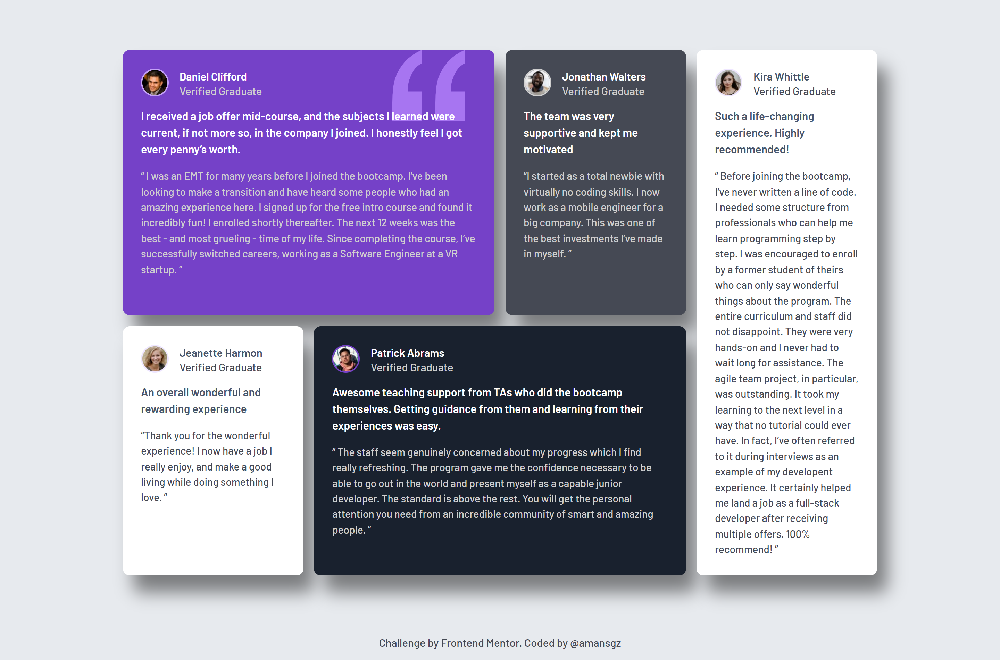

# Frontend Mentor - Testimonials Grid Section

This is a solution to the [Testimonials grid section challenge on Frontend Mentor](https://www.frontendmentor.io/challenges/testimonials-grid-section-Nnw6J7Un7).

## Table of contents

- [Overview](#overview)
  - [The challenge](#the-challenge)
  - [Screenshot](#screenshot)
  - [Links](#links)
- [My process](#my-process)
  - [Built with](#built-with)
  - [What I learned](#what-i-learned)
  - [Continued development](#continued-development)
  - [Useful resources](#useful-resources)
- [Author](#author)
- [Acknowledgments](#acknowledgments)

## Overview

### The challenge

Users should be able to:

- View the optimal layout for the site depending on their device's screen size

### Screenshot



### Links

- Solution URL: [https://www.frontendmentor.io/solutions/responsive-grid-testimonials-T80R2f8_Ox](https://www.frontendmentor.io/solutions/responsive-grid-testimonials-T80R2f8_Ox)
- Live Site URL:
  [https://amansgz.github.io/building-responsive-layouts/testimonials-grid-section/index.html](https://amansgz.github.io/building-responsive-layouts/testimonials-grid-section/index.html)

## My process

### Built with

- Semantic HTML5 markup
- BEM Methodology
- CSS Custom Properties
- CSS Contextual Variables
- Flexbox
- CSS Grid
- Mobile-first workflow

### What I learned

I implemented `grid-system` with `grid-template-areas`.

And implemented a powerful architecture pattern using **contextual CSS custom properties**. This approach creates self-contained, themeable components that automatically adapt their styling based on their context.

**Key Concepts Implemented:**

1. **Contextual Theming System**
   I defined CSS variables at the **card level** that propagate down to all children:

```css
.testimonial--featured {
  background-color: var(--clr-primary-500);

  --avatar-border-color: var(--clr-primary-300);
  --text-primary-color: var(--clr-white);
  --text-secondary-color: var(--clr-grey-200);
}
```

2. **Component-Based Consumption**
   Child components consume these contextual variables without knowing about their parent:

```css
.testimonial__avatar {
  border: 2px solid var(--avatar-border-color, transparent);
}

.testimonial__name {
  color: var(--text-primary-color, currentColor);
}
```

3. **Automatic Theme Propagation**
   Component automatically adapt based on their container's theme variables. No need for multiple modifier classes.

```html
  <article class="testimonial testimonial--featured">

    
    <h3 class="testimonial__name">
    <p class="testimonial__highlight">

  </article>
```

**Benefits discovered**

- Cleaner HTML
- Easier Maintenance
- Scalability

**Technical Implementation**

1. Root Variables: Define color palette at :root
2. Contextual Variables: Define theme variables at component level
3. Fallback Values: Use `var(--variable, fallback) for safety
4. Cascading Inheritance: Variables cascade naturally through the DOM

**Conclusion**

The pattern works particularly well for card-based interfaces where multiple visual variations share the same structural markup, allowing for rapid theme creation and consistent styling across an entire application.

### Continued development

Moving forward, I aim to build more efficient and accessible responsive websites, focusing on performance and user experience across different devices.

### Useful resources

- [Building responsive layouts](https://www.frontendmentor.io/learning-paths/building-responsive-layouts-z1qCXVqkD) - This challenge is part of Frontend Mentor's learning path. The challenges in this path are designed to help you get to grips with making layouts that work across all devices.

## Author

- Frontend Mentor - [@amansgz](https://www.frontendmentor.io/profile/amansgz)
- Github - [@amansgz](https://github.com/amansgz)

## Acknowledgments

- [Frontend Mentor](https://www.frontendmentor.io/) challenges help you improve your coding skills by building realistic projects.
